# acfour_Diego_Grajeda

### 1. Crea una solució de tipus consola al teu IDE (sense cap codi) i inicialitza-la al teu git i Github. El nom de la solució (i repositori) ha de seguir la notació següent: acfour_name_surname (sense accents ni altres caràcters).
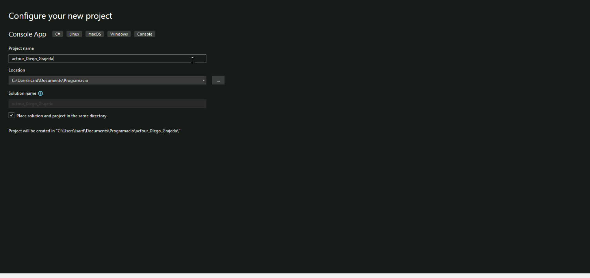
(solution tipus consola creada en el IDE Visual Studio Community amb el nom solicitat)

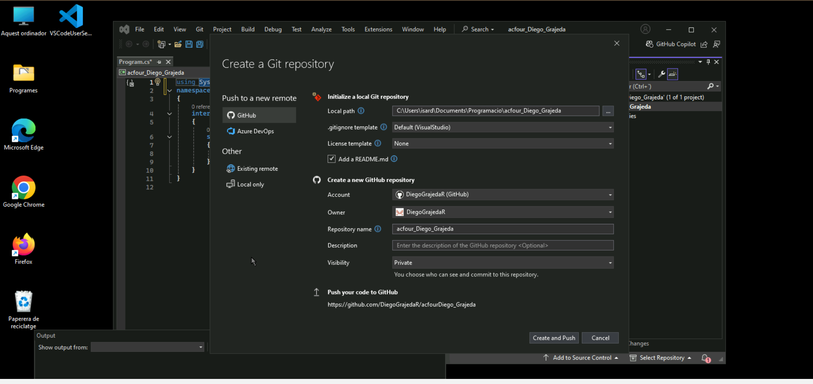
(repositori creat desde el Github de Visual Studio Community)

### 2. Crea un projecte al Github amb el nom: Project acfour_name_surname
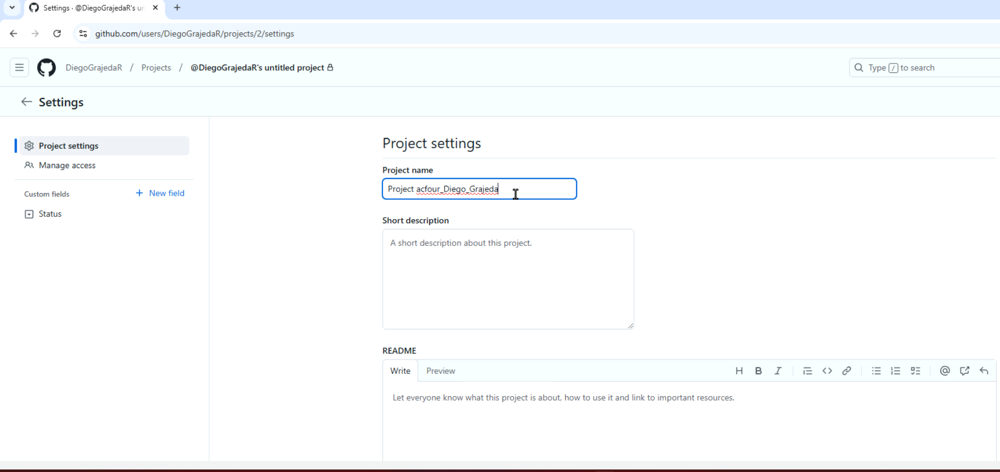
(projecte creat desde el Githubamb el nom solicitat)

### 3. Crea una issue al projecte per  implementar el diagrama de flux (Draw.io, Mermaid, Visio, Slides, ….) que solucioni el problema indicat a continuació (vincula-la al repositori creat a l’apartat 1, com una branca del main)  i puja’l al repositori amb el nom: flowchart_name_surname (extensió .jpg o .png). “Implementa un programa que permeti a l’usuari emmagatzemar una quantitat determinada de nombres naturals (indicat aquest nombre prèviament per l’usuari) i després els mostri per pantalla.” Un cop resolta, tanca la issue del projecte.
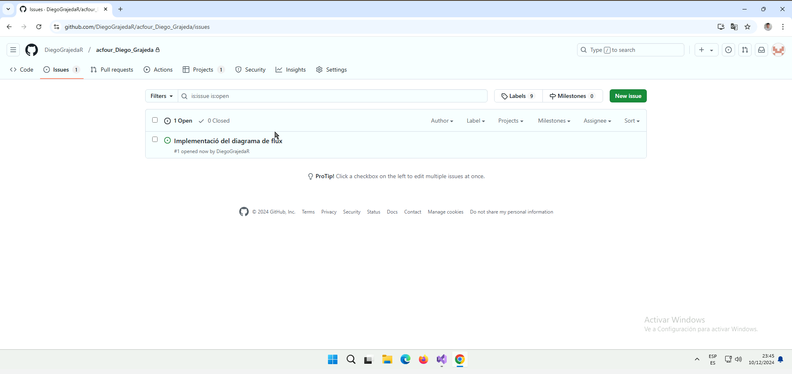
(issue creat i després implementat en el projecte creat de l'anterior apartat, solicita crear el diagrama de flux)

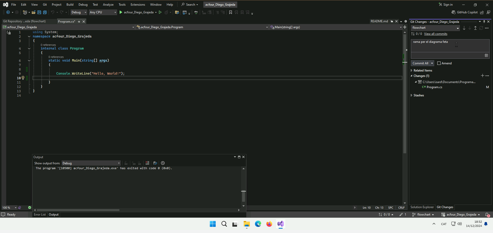
(nova rama "flowchart" creada per afegir el diagrama de flux en format png)

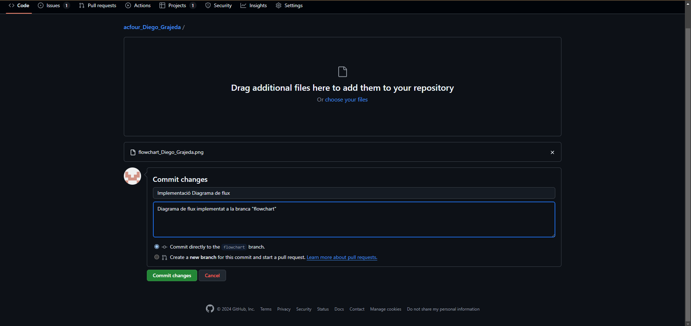
(diagrama de flux afegit al repositori en la branca "flowchart")

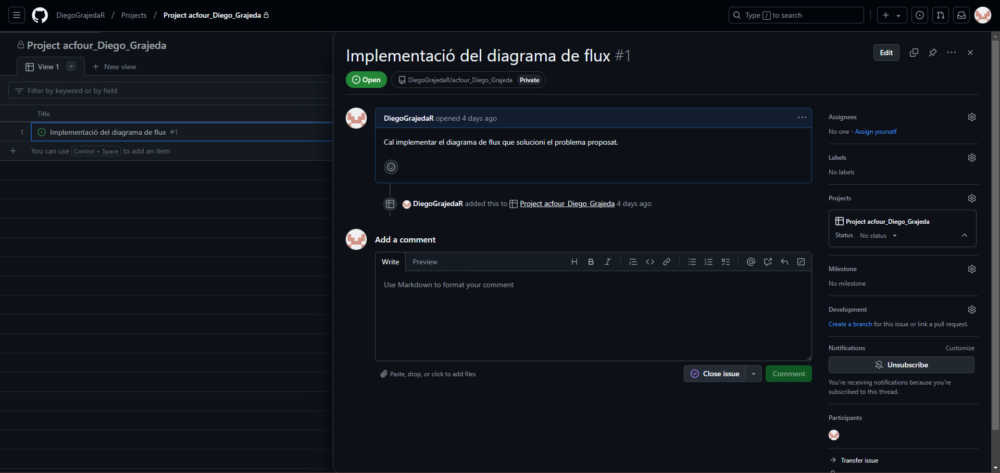
(un cop hem implmentat el diagrama al nostre repositori podem tancar la issue del projecte)

### 4. Implementa en C# el diagrama anterior. Cal crear un issue nou i una branca nova. Actualitza la branca principal.
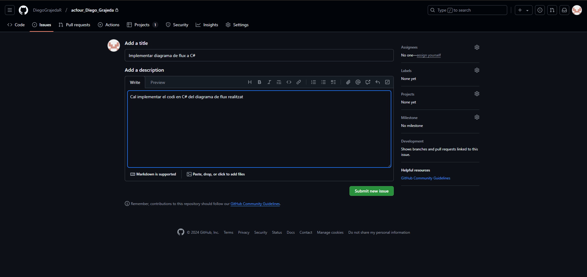
(creem una nova issue en el projecte que soliciti la implementació en codi C# del diagrama)

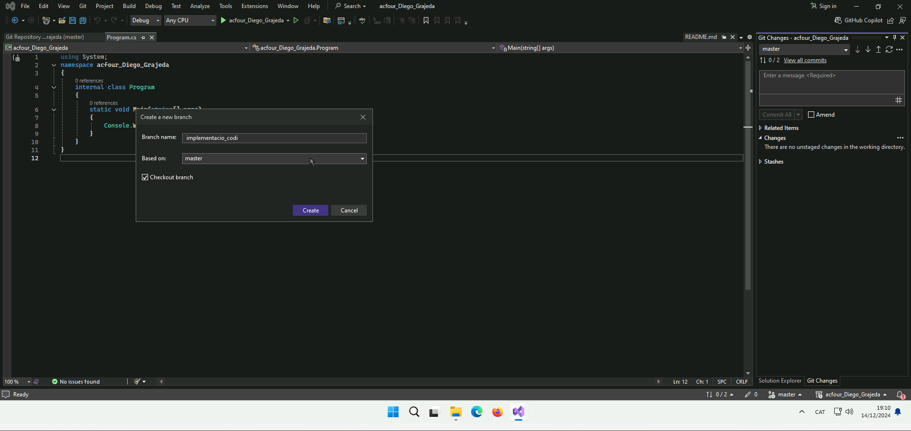
(també creem una nova branca "implementacio_codi" on guardarem el programa realizat)

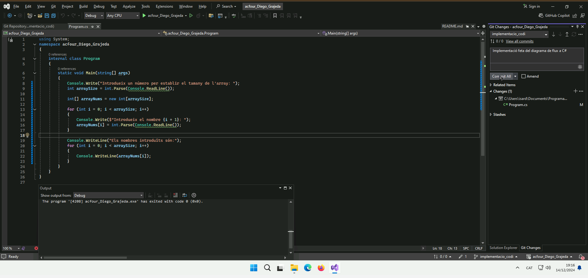
(realitzat el programa en C# farem un commit per després fer un push)

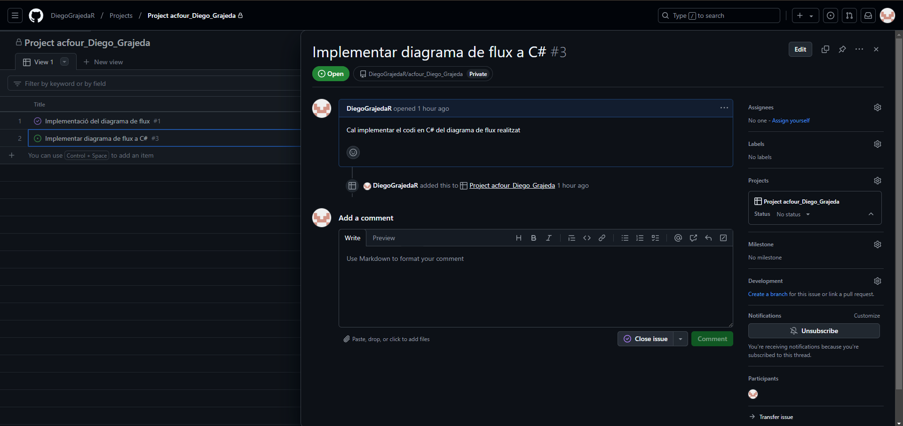
(tancarem la issue que vam crear per afegir el programa en C#)

### 5. Implementa en C# la nova funcionalitat següent: el programa en finalitzar de mostrar els valors els ha de mostrar ordenats de manera descendent per consola.
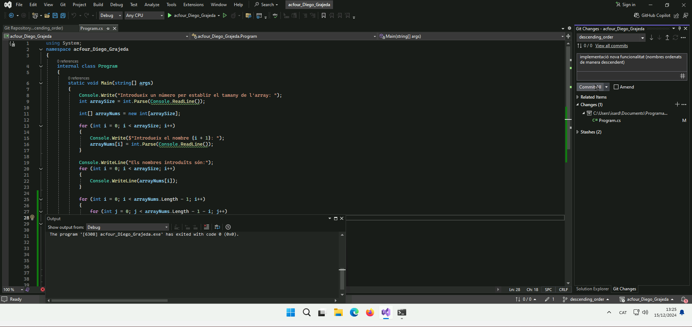
(hem creat un nova branca "descending_order" per afegir la nova funcionalitat d'ordenar els nombres de manera descendent. En la branca "main" vaig implementar el programa final amb algunes millores al codi per a que només accepti valors naturals degut a que no ho vaig implementar en el apartat anterior després, vaig fer un commit i un push)

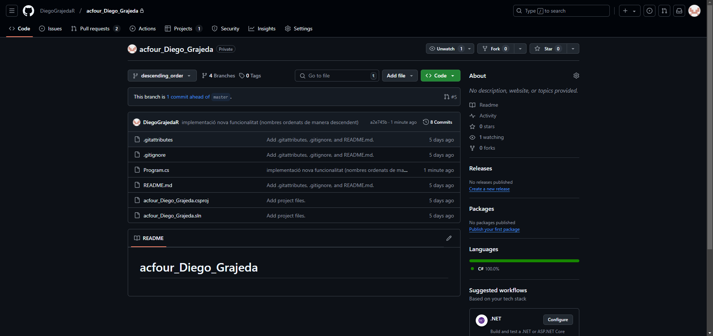
(aqui es pot veure la branca "descending_order" amb el programa modificat, no es el programa definitiu amb les millores. El prgrama definitiu es troba en la branca "main")

### 6. Implementa els tests unitaris pels mètodes implementats. Cal crear una issue per cada tasca.
He creat la issue titulada "implementar unit test" però no he fet el unit test perquè no sabia com fer-ho i tambè perquè no hem deixaba vincular-ho amb el programa"

### 7. Pujar al readme els enllaços que heu consultat. En cas de no haver-ne consultat cap, indicar-ho al readme.
https://sites.google.com/itb.cat/entornsprogramacioiprocesos/teoria/t1-introducci%C3%B3/2-disseny-dalgorismes/2-2-disseny/2-2-3-diagrames-de-flux
--->
(Sites de programació amb la teoria. Consultat: 15/12/24)
